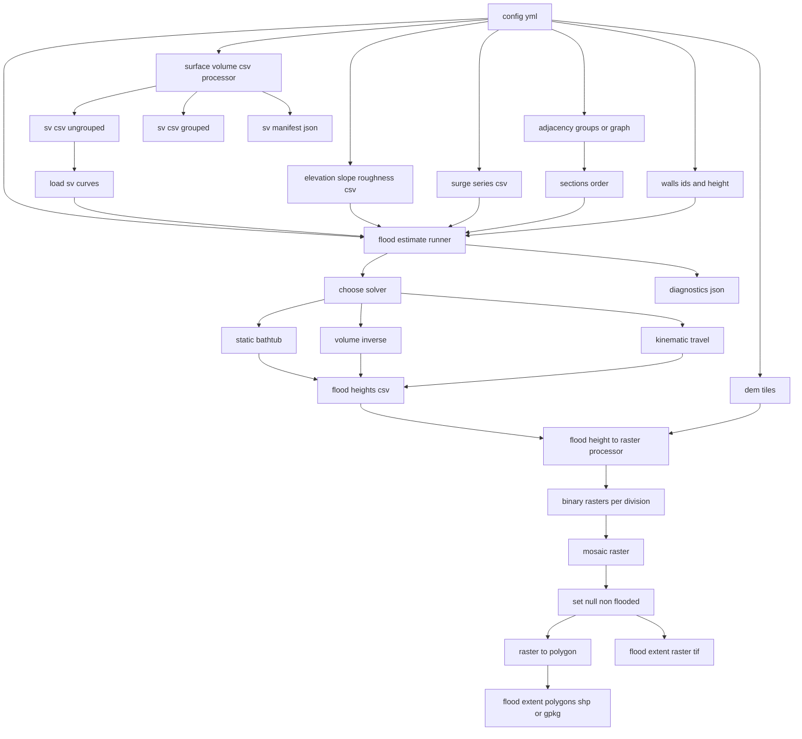

# Generalized GISSR Flood Simulation

This folder implements the config-driven GISSR pipeline, which automates flood estimation from DEMs to final inundation rasters.

---

## End-to-End Pipeline

```mermaid
flowchart TD
  C0[config yml] --> SVA[surface volume csv processor]
  C0 --> RUN[flood estimate runner]
  C0 --> ELEV[elevation slope roughness csv]
  C0 --> SURG[surge series csv]
  C0 --> ADJ[adjacency groups or graph]
  C0 --> WALLS[walls ids and height]

  SVA --> SVU[sv csv ungrouped]
  SVA --> SVG[sv csv grouped]
  SVA --> MAN[sv manifest json]

  SVU --> CUR[load sv curves]
  CUR --> RUN
  ELEV --> RUN
  SURG --> RUN
  ADJ --> SECT[sections order]
  SECT --> RUN
  WALLS --> RUN

  RUN --> SOLS[choose solver]
  SOLS --> SB[static bathtub]
  SOLS --> VI[volume inverse]
  SOLS --> KT[kinematic travel]

  SB --> HCSV[flood heights csv]
  VI --> HCSV
  KT --> HCSV
  RUN --> DJSON[diagnostics json]

  HCSV --> RAS[flood height to raster processor]
  C0 --> DEMS[dem tiles]
  DEMS --> RAS

  RAS --> RTILES[binary rasters per division]
  RTILES --> RMOSAIC[mosaic raster]
  RMOSAIC --> RNULL[set null non flooded]
  RNULL --> RPOLY[raster to polygon]
  RNULL --> RFINAL[flood extent raster tif]
  RPOLY --> PFINAL[flood extent polygons shp or gpkg]
```
